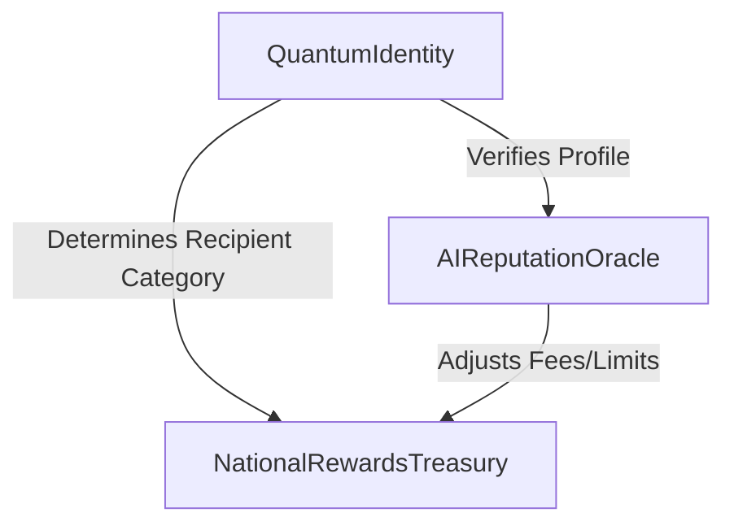
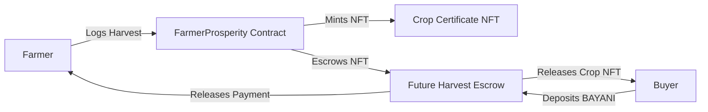
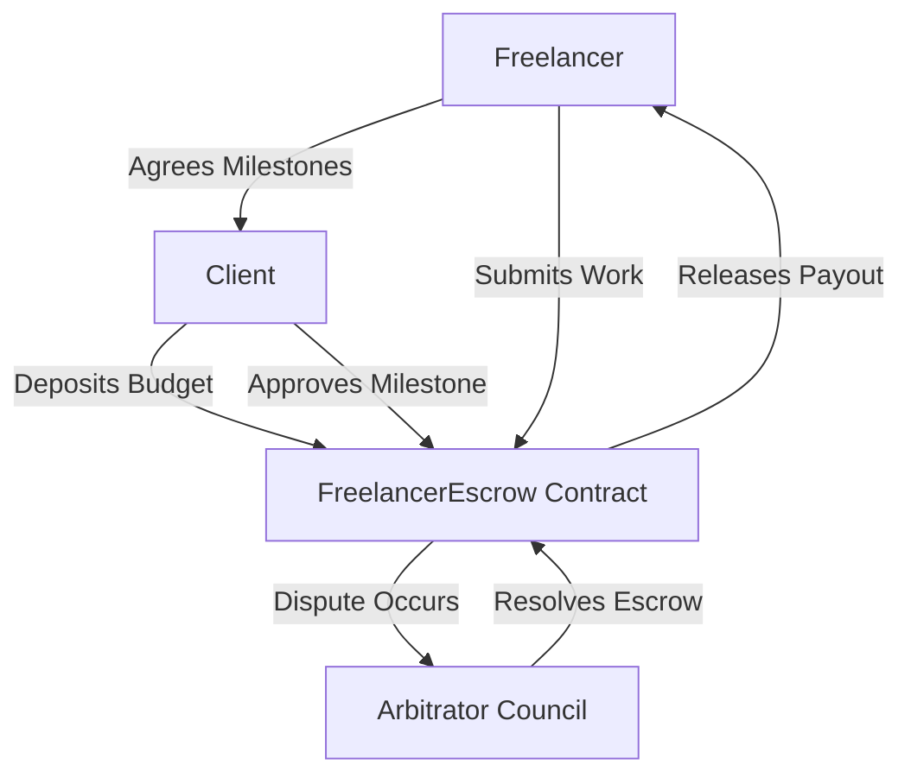
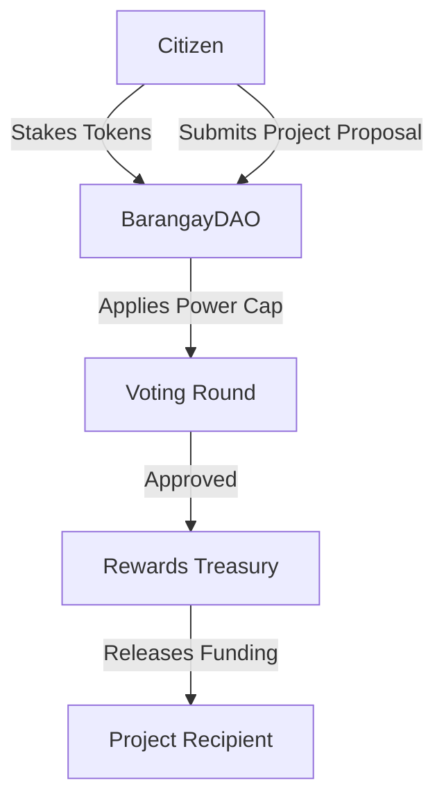
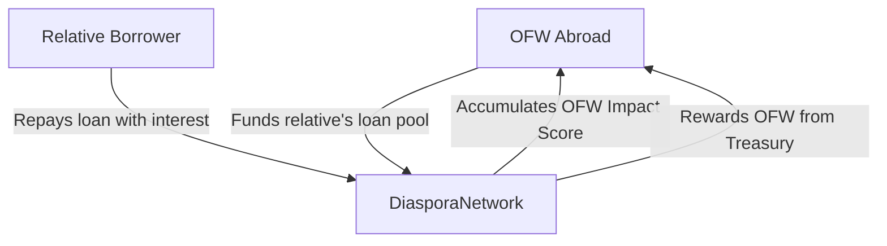

# Bayanihan Quantum Commerce Chain: A Plain-English Guide to Web3 for Communities

Welcome to the **Bayanihan Web3 E-Book**. This guide is designed specifically for non-technical readers, community organizers, students, and entrepreneurs. Our goal is to demystify **Web3, blockchain, and smart contracts** by showing how they function in the real world. 

Instead of theoretical math, we will explore these concepts through the lens of **Bayanihan**—the traditional Filipino spirit of communal unity, cooperation, and mutual support. We will analyze the **15 custom smart contracts** that power the Bayanihan digital nation, turning complex Solidity code into clear, everyday analogies.

---

## Table of Contents
1. **Introduction: What is Web3 & Why Bayanihan?**
2. **Chapter 1: The Trust Pillars (Core Infrastructure)**
   * *QuantumIdentity.sol* (Digital ID & Recovery)
   * *AIReputationOracle.sol* (Off-Chain Credit/Reputation)
   * *NationalRewardsTreasury.sol* (Community Payouts)
3. **Chapter 2: Sowing Trust in the Field (Agriculture & Sustainability)**
   * *FarmerProsperity.sol* (Crop NFTs, Forward Sales & Weather Insurance)
   * *FisherfolkRewards.sol* (Sustainable Fishing Log)
   * *RenewableEnergy.sol* (Solar Metering & Carbon Credits)
4. **Chapter 3: Grassroots Economic Growth (Livelihood & Economy)**
   * *MSMEGrowth.sol* (Sari-Sari Credit Scores & Fee Discounts)
   * *FreelancerEscrow.sol* (Milestone Project Protection)
   * *EducationRewards.sol* (Soulbound Badges & Scholarships)
5. **Chapter 4: The Digital Barangay (Community Solidarity)**
   * *BarangayDAO.sol* (Whale-Proof Voting & Public Proposals)
   * *HealthcareAssistance.sol* (Mutual Aid Paluwagan)
   * *HousingCooperative.sol* (Fractional Brick-by-Brick Equity)
6. **Chapter 5: Borders & Legacy (Diaspora & Inheritance)**
   * *DiasporaNetwork.sol* (OFW Lending & Impact Tracking)
   * *NationalAssetTokenization.sol* (Utility RWA Tokenization)
   * *BayaniLegacy.sol* (Proof-of-Life Succession Trust)
7. **The Ultimate Plain-English Web3 Glossary**

---

# Introduction: What is Web3 & Why Bayanihan?

To understand Web3, it helps to look at how the internet has evolved:

| Era | Core Capability | Control | Visual Analogy |
|---|---|---|---|
| **Web1 (1990s)** | Read-Only | Centralized (Publishers) | A library where you can only read books off the shelves. |
| **Web2 (2000s-Present)** | Read & Write | Centralized (Big Tech Corporations) | A social media board where you upload content, but the board owner owns your data and profile. |
| **Web3 (Future)** | Read, Write & Own | Decentralized (The Community) | A cooperative marketplace owned, run, and secured by the participants themselves. |

### The Core Engine: The Smart Contract
A **Smart Contract** is simply a digital agreement written in code. It resides on a blockchain, meaning it is **immutable** (cannot be changed or deleted once published) and **trustless** (runs automatically without requiring a bank, lawyer, or government official to enforce it).

> [!TIP]
> **The Vending Machine Analogy:**
> Think of a traditional contract as hiring a lawyer: you pay them, wait, and hope they enforce the rules.
> A smart contract is like a vending machine: you drop in a coin (input data/tokens), and the machine automatically drops your soda (output code action). There is no intermediary to change their mind.

Let's dive into how the Bayanihan suite uses this technology to support community livelihoods.

---

# Chapter 1: The Trust Pillars (Core Infrastructure)

Before a community can trade, they need to know who is who, who can be trusted, and how community assets are funded. These three contracts form the infrastructure of our digital cooperative.



---

## 🛡️ 1. QuantumIdentity.sol: Post-Quantum Digital ID & Social Recovery

### The Hook
Imagine losing the keys to your house, and the locksmith tells you that you can never enter again, and everything inside is lost forever. In early blockchain systems, losing your private keys meant losing your life savings. How do we build a system that is secure enough to withstand future supercomputers (quantum computers) but gentle enough to help you recover your account?

### Core Lesson
In Web3, your wallet address is your account. **QuantumIdentity.sol** is a smart registry that does two things:
1. **Post-Quantum Cryptographic Agility:** It has built-in storage slots (`PQKey`) that can absorb next-generation keys (like Crystals-Dilithium) to make sure quantum computers can't hack your account.
2. **Social Recovery:** Instead of relying on a password reset button (which requires a centralized company), you nominate a group of **Guardians** (trusted family, friends, or barangay members). If you lose your keys, a majority of these guardians vote on-chain to move your profile to a new wallet address.

### Practical Application: Nominating Guardians
* **Rule of Thumb:** Nominate at least 3-5 guardians (contracts require a minimum of 2).
* **Diversification:** Choose people who do not know each other well or live in different neighborhoods to avoid them colluding to hijack your account.

### Common Mistakes
* ⚠️ **Guardian Neglect:** Forgetting to update your guardians when a friend changes their phone/wallet, or when a relationship changes.
* ⚠️ **Self-Recovery Failure:** Trying to initiate recovery using your own old wallet. The old wallet is lost; only your guardians can call `initiateRecovery()`.

---

## 📊 2. AIReputationOracle.sol: Off-Chain Character Reference

### The Hook
When a local bank decides to lend you money, they look up your credit history. But what if you are a freelancer or a farmer who has never had a bank account? How do you prove you are reliable to someone on the other side of the country?

### Core Lesson
An **Oracle** is a bridge that brings real-world data onto the blockchain. **AIReputationOracle.sol** takes external data (like customer ratings, on-time deliveries, and community work) and logs a verified **Reputation Score** (from 0 to 100) on-chain.
* **Cryptographic Signatures (ECDSA):** To prevent malicious actors from falsifying scores, the data must be digitally signed by an authorized validator.

### Practical Application: Building Score
```
[Organic Farming] + [On-Time Deliveries] + [DAO Participation] 
   == (Signed by AI Validator) ==> On-Chain Rep Score (e.g. 95/100)
```

### Common Mistakes
* ⚠️ **Assuming Scores are Static:** Your reputation score fluctuates based on on-chain activities. A dispute in a freelance contract will automatically trigger a penalty, lowering your score.

---

## 🏦 3. NationalRewardsTreasury.sol: The Community Safety Vault

### The Hook
If a community cooperative has a communal vault, what is to stop one greedy member from showing up with a truck and loading all the sacks of rice at once, leaving nothing for the rest?

### Core Lesson
**NationalRewardsTreasury.sol** is the smart vault that manages the distribution of incentives.
* **Rate Limits:** It enforces strict caps on how much can be claimed at once.
* **Authorized Category Allocations:** It allocates treasury funds by percentages, directing set ratios to the Community Treasury, Ecosystem Rewards, Validators, and other core functions.

### Summary: Chapter 1 Key Takeaways
1. **Post-Quantum Identity** keeps you safe from future hackers and uses trusted neighbors for recovery.
2. **Oracles** connect real-life achievements to your digital record.
3. **Treasuries** run on automated smart math to distribute community incentives fairly and sustainably.

---

# Chapter 2: Sowing Trust in the Field (Agriculture & Sustainability)

Bayanihan applies smart contracts to physical work: harvesting crops, fishing sustainably, and generating solar energy.



---

## 🌾 4. FarmerProsperity.sol: Crop Certificates & Weather Insurance

### The Hook
A farmer works hard for three months, only for a typhoon to destroy the crop. The local middleman offers a predatory loan to help them survive. How can Web3 break this cycle?

### Core Lesson
**FarmerProsperity.sol** introduces three powerful Web3 concepts:
1. **Crop NFTs (ERC-1155):** When a farmer logs a harvest, the contract mints a unique digital certificate. This token proves they own and produced a specific quantity of crops (organic, climate-friendly, water-conserving).
2. **Forward Sales Escrow:** Farmers can list their future harvests for sale. A buyer escrows (locks) payment tokens inside the contract. Once delivered, the funds release to the farmer, and the NFT goes to the buyer. No middleman needed.
3. **Weather-Indexed Insurance:** The farmer pays a small premium into an insurance pool. If a climate oracle registers a disaster (e.g., wind speeds exceeding a typhoon threshold), the contract automatically payouts up to 10x the premium directly to the farmer's wallet without requiring a claims adjuster.

### Practical Application: Crop Listing Framework
| Step | Action | Actor | On-Chain State |
|---|---|---|---|
| 1 | Register Harvest | Farmer | NFT Minted + Eco-Rewards Disbursed |
| 2 | List Future Harvest | Farmer | NFT Locked in Escrow |
| 3 | Purchase | Buyer | Funds Locked in Escrow |
| 4 | Confirm Delivery | Buyer/Farmer | NFT to Buyer, Funds to Farmer |

---

## 🐟 5. FisherfolkRewards.sol: Oceans of Data & Catch Verification

### The Hook
If a fisher logs that they caught 100 kg of tuna, how do we know they didn't catch endangered reef fish instead, or catch them in a marine sanctuary?

### Core Lesson
**FisherfolkRewards.sol** rewards sustainable fishing through decentralized verification:
* **Catch Logging:** Fisherfolk log the weight, species, and GPS coordinates on-chain.
* **Peer/Validator Audits:** Trusted local wardens verify the catch's compliance before bonuses are unlocked.
* **Eco-Multipliers:** Catching sustainable species or participating in beach cleanups boosts their on-chain "Impact Score," unlocking treasury rewards.

---

## ☀️ 6. RenewableEnergy.sol: Peer-to-Peer Solar Trading

### The Hook
If you install solar panels on your roof, you often have to sell excess energy back to a single monopoly utility grid at a price they dictate. What if you could barter your clean energy credits directly with your neighbors?

### Core Lesson
**RenewableEnergy.sol** handles decentralized smart meter logs:
* **Generation Logs:** Smart meters digitally sign and post energy outputs (kWh) to the blockchain.
* **Energy Credit Bartering:** The contract maintains a ledger of energy credits. Neighbors can trade energy tokens peer-to-peer to pay for power, avoiding central markups.

---

# Chapter 3: Grassroots Economic Growth (Livelihood & Economy)

Let's look at how local businesses, freelancers, and students use smart contracts to grow their livelihoods.



---

## 🏪 7. MSMEGrowth.sol: Building Small Business Credit Histories

### The Hook
A *sari-sari* store (micro-convenience shop) runs entirely on cash. Because there are no formal records, they can't get a bank loan to expand, forcing them to turn to loan sharks.

### Core Lesson
**MSMEGrowth.sol** creates a formal, trustless business ledger:
* **Revenue Logging:** Small merchants log their daily sales on-chain.
* **Community Contributions:** MSMEs earn reputation points by participating in local drives.
* **Fee Discounts:** As they build up positive reviews and revenue history, the contract elevates their tier, granting them lower digital transaction fees and higher credit ratings.

---

## 💻 8. FreelancerEscrow.sol: Safe Payments for Remote Workers

### The Hook
A freelance graphic designer finishes a logo for an international client, only for the client to block them and refuse to pay. Conversely, a client pays a developer upfront, only for the developer to disappear.

### Core Lesson
**FreelancerEscrow.sol** secures payments through a **Neutral Escrow Lock**:
* **Milestone Payments:** The project budget is broken into phases and locked in the contract *before* work starts.
* **Fee Discount by Reputation:** High-reputation freelancers get up to a 50% discount on contract escrow fees.
* **On-Chain Arbitration:** If a dispute arises, an elected council of community arbiters reviews the work. The contract automatically executes their split decision (e.g., 70% refund to client, 30% payout to freelancer).

---

## 🎓 9. EducationRewards.sol: Soulbound Credentials & Scholarships

### The Hook
In a world of digital forgery, anyone can copy-paste a certificate or resume. How can we prove a student actually took a class and passed it, without needing to verify with a university registrar every time?

### Core Lesson
**EducationRewards.sol** introduces **Soulbound Tokens (SBTs)**:
* **Soulbound Credentials:** When a student passes an assessment, they receive a non-transferable NFT badge. If they try to sell or transfer it, the contract blocks the transaction. The badge is permanently bound to their digital identity ("soul").
* **Smart Scholarships:** Generous donors fund a scholarship pool. The contract automatically distributes stipends to students based on their on-chain badge levels.

---

# Chapter 4: The Digital Barangay (Community Solidarity)

How do we organize local decisions, mutual healthcare funds, and community housing without high management overhead?



---

## 🏛️ 10. BarangayDAO.sol: Democratic Decisions without Whales

### The Hook
In typical blockchain voting (DAOs), voting power is determined by the number of tokens you own. This means a single multi-millionaire (a "whale") can outvote 1,000 ordinary community members combined. How do we keep democracy fair?

### Core Lesson
**BarangayDAO.sol** solves this by implementing **Voting Power Caps**:
* **Decentralized Autonomous Organization (DAO):** An organization run by code, where proposals are submitted and executed by vote.
* **Democratic Power Cap:** No matter how many tokens a wealthy landlord stakes, their voting weight is capped. This ensures that infrastructure, scholarship, or emergency funding proposals represent the actual community's voice.

---

## 🏥 11. HealthcareAssistance.sol: Mutual Aid Paluwagan

### The Hook
Traditional health insurance is expensive, full of fine print, and slow to pay. A family emergency can push a household into extreme debt.

### Core Lesson
**HealthcareAssistance.sol** digitizes the traditional Filipino *paluwagan* (mutual savings club):
* **Cooperative Savings:** Members deposit savings into a mutual pool.
* **Peer-Reviewed Claims:** When a member falls ill, they submit a hospital bill hash. Local community validators vote to approve or reject the claim.
* **Automated Payouts:** Once approved, emergency funds release directly to the hospital or the patient's wallet.

---

## 🏠 12. HousingCooperative.sol: Crowdfunded Homes

### The Hook
Buying a home requires a bank mortgage with high interest rates. If you fall behind, a foreign bank forecloses on your property.

### Core Lesson
**HousingCooperative.sol** fractionally funds houses within the community:
* **Cooperative Construction Pools:** The community pools funds to buy land and build homes. Contributors own shares in the project.
* **On-Chain Mortgages:** Borrowers pay their monthly installments directly to the contract. Consistent on-time payments award them community bonuses.

---

# Chapter 5: Borders & Legacy (Diaspora & Inheritance)

Connecting family members abroad, tokenizing real assets, and protecting the next generation.



---

## ✈️ 13. DiasporaNetwork.sol: Supporting Families Across Borders

### The Hook
Overseas Filipino Workers (OFWs) send billions of dollars home every year, but traditional remittance networks charge high transfer fees. Additionally, OFWs have little control over how their remittances are used.

### Core Lesson
**DiasporaNetwork.sol** establishes direct support pools:
* **Relative Lending Pools:** An OFW can fund an interest-bearing lending pool for their relatives back home. The contract handles the repayment logic.
* **Diaspora Impact Score:** OFWs earn rewards and community recognition when their investments fund local jobs or clean energy infrastructure.

---

## 🏢 14. NationalAssetTokenization.sol: Fractional RWAs with Utility Yields

### The Hook
If a community wants to fund a solar park or a public warehouse, they might want to sell shares to the public. However, paying out cash dividends often triggers strict regulatory compliance audits under securities law.

### Core Lesson
**NationalAssetTokenization.sol** tokenizes **Real-World Assets (RWAs)** using **Utility Yields**:
* **Fractional Shares:** An asset (like a warehouse) is split into digital shares that citizens can purchase.
* **Utility Yields (No Cash Dividends):** To satisfy SEC regulations, the contract does not distribute cash. Instead, it yields **Utility Points** that can be burned for discounts (e.g., free warehouse storage space or cheap electricity). This keeps the asset classified as a utility rather than a security.

---

## 🕯️ 15. BayaniLegacy.sol: Inheritance Trusts without Lawyers

### The Hook
If a blockchain user unexpectedly passes away, their digital assets are locked forever inside their wallet, lost to their grieving family.

### Core Lesson
**BayaniLegacy.sol** is an automated inheritance vault:
* **Proof of Life:** The owner must interact with the contract regularly (e.g., once every 6 months) to trigger a `registerProofOfLife()` heartbeat.
* **Inactivity Trigger:** If the owner fails to call the heartbeat before the inactivity timeout expires, the contract unlocks.
* **Succession Execution:** Nominated family members or successors can claim their pre-allocated shares directly from the vault, distributing inheritance automatically and without probate fees.

---

# The Ultimate Plain-English Web3 Glossary

* **Blockchain:** A shared, digital notebook that everyone can view, but no one can erase or alter. It records who owns what.
* **Smart Contract:** A digital vending machine. An automated agreement that executes automatically once its coded rules are met.
* **Token:** A digital unit of value (like game credits) stored on a blockchain. Can represent money (BAYANI), energy credits, or RWA shares.
* **NFT (Non-Fungible Token):** A digital certificate of ownership for a unique item (like a crop harvest certificate or a house deed).
* **Soulbound Token (SBT):** A special type of NFT that cannot be sold or transferred. It is permanently tied to your profile (like a diploma).
* **DAO (Decentralized Autonomous Organization):** A digital cooperative run by smart contracts, where members vote on decisions.
* **Oracle:** A secure bridge that brings external data (like weather conditions or AI reputation scores) onto the blockchain.
* **Escrow:** A neutral third-party lock box. Money is held by the smart contract until the freelancer or farmer delivers their work.
* **Post-Quantum Cryptography:** Advanced security methods that protect your identity and funds from being hacked by future supercomputers.
* **Gas:** A small fee paid to the blockchain network to process your transaction.
* **Paluwagan (Mutual Pool):** A traditional informal saving/credit circle, digitized as an on-chain mutual assistance contract.
