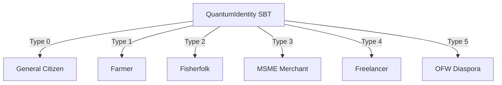

# 🇵🇭 Bayanihan Quantum Commerce Chain - Role Architecture

This document defines the roles within the Bayanihan economic operating system. It maps out both **Citizen Economic Roles** (registered as Soulbound Profile types) and **Protocol Administrative Roles** (enforced via OpenZeppelin's `AccessControl` library).

---

## 👥 1. Citizen Economic Roles (Soulbound Profile Types)

Citizen identities are registered in [`QuantumIdentity.sol`](file:///c:/Users/janla/Bayanihan/contracts/core/QuantumIdentity.sol) as non-transferable (soulbound) profiles to eliminate identity speculation. Each profile is assigned a specific `IdentityType` which governs their access to economic functions across the smart contract suite.

### 👩 General Citizen (Type 0)
- **Primary Function:** Base economic participant, community voting, and mutual aid.
- **Smart Contract Touchpoints:**
  - **[`BarangayDAO.sol`](file:///c:/Users/janla/Bayanihan/contracts/features/BarangayDAO.sol):** Casts democratic votes on community infrastructure proposals using a base citizenship weight of +100 Voting Units.
  - **[`HealthcareAssistance.sol`](file:///c:/Users/janla/Bayanihan/contracts/features/HealthcareAssistance.sol):** Participates in mutual aid healthcare pools, deposit savings, and triggers medical reimbursement claims.
  - **[`BayaniLegacy.sol`](file:///c:/Users/janla/Bayanihan/contracts/features/BayaniLegacy.sol):** Manages time-locked generational trusts, inheritance distributions, and builder status long-term achievements.
- **Compliance Alignment:** Staking weights are capped to maintain grassroots democratic fairness and prevent central plutocratic capture.

### 👨‍🌾 Farmer (Type 1)
- **Primary Function:** Agricultural production, crop forward-selling, and weather risk hedging.
- **Smart Contract Touchpoints:**
  - **[`FarmerProsperity.sol`](file:///c:/Users/janla/Bayanihan/contracts/features/FarmerProsperity.sol):** Mints unique Crop NFTs representing registered harvests. Logs volume, organic status (unlocking 2x labor rewards), and climate eligibility.
  - **Direct-to-Consumer (DTC) Marketplace:** Lists forward-sales crop contracts. Escrows lock purchaser funds until delivery is verified.
  - **Parametric Weather Insurance:** Automatically receives payouts from locked pools if weather oracles submit extreme typhoon/drought events.

### 🎣 Fisherfolk (Type 2)
- **Primary Function:** Sustainable fishery logging, maritime patroller incentives, and source provenance.
- **Smart Contract Touchpoints:**
  - **[`FisherfolkRewards.sol`](file:///c:/Users/janla/Bayanihan/contracts/features/FisherfolkRewards.sol):** Logs seafood catches, registers sustainability scores, and records marine officer certifications.
  - **Conservation Pools:** Earns patroller incentives funded by the treasury for reporting illegal fishing or actively maintaining marine protected sanctuaries.

### 🏪 MSME Merchant (Type 3)
- **Primary Function:** Retail commerce, business growth logging, and reputation-based credit access.
- **Smart Contract Touchpoints:**
  - **[`MSMEGrowth.sol`](file:///c:/Users/janla/Bayanihan/contracts/features/MSMEGrowth.sol):** Logs verified sales volumes, gathers customer star ratings, and tracks merchant tier upgrades (Bronze, Silver, Gold, Platinum).
  - **Credit Rating Engine:** Dynamic credit scores build from transactions and reviews, lowering fee requirements and unlocking cooperative credit line access.
- **Compliance Alignment:** MSME tier perks (discounts on transaction fees) act strictly as utility rebates, avoiding secondary securitized profit models.

### 👨‍💻 Freelancer (Type 4)
- **Primary Function:** Professional service delivery, digital commerce, and contract dispute resolution.
- **Smart Contract Touchpoints:**
  - **[`FreelancerEscrow.sol`](file:///c:/Users/janla/Bayanihan/contracts/features/FreelancerEscrow.sol):** Locks budget deposits in milestone-based smart contracts. Submits deliverables, triggers client payments, and initiates peer arbitration if disputes occur.
- **Compliance Alignment:** Escrow contracts function as operational escrow boxes for service transactions rather than banking deposits, ensuring compliance with BSP licensing requirements.

### ✈️ OFW Diaspora Member (Type 5)
- **Primary Function:** Remittance-supported lending and national utility asset investments.
- **Smart Contract Touchpoints:**
  - **[`DiasporaNetwork.sol`](file:///c:/Users/janla/Bayanihan/contracts/features/DiasporaNetwork.sol):** Remits capital, funds peer-to-peer relative micro-loans, and tracks local jobs created.
  - **[`NationalAssetTokenization.sol`](file:///c:/Users/janla/Bayanihan/contracts/features/NationalAssetTokenization.sol):** Invests in fractionalized real-world assets (RWA) like regional cold storages or solar microgrids.
- **Compliance Alignment:** Return yields are distributed strictly as utility service discounts (e.g. 10% discount on electricity grid fees) rather than cash dividends, mitigating SEC securities classification risks.

---

## ⚙️ 2. Protocol Administrative Roles (Solidity Access Control)

Every smart contract implements role-based access control (RBAC) via OpenZeppelin's `AccessControl` rather than single-owner keys. This modular approach reduces centralization risks.

| Role Name | Primary Responsibility | Associated Contracts |
| :--- | :--- | :--- |
| **`GOVERNOR_ROLE`** | System pauses, parameters, and protocol updates | All contract suite features |
| **`VALIDATOR_ROLE`** | Verification of academic course completion and smart telemetry meters | `EducationRewards.sol`, `RenewableEnergy.sol` |
| **`ORACLE_ROLE`** | Submission of signed data (weather, AI credit ratings, grid telemetry) | `AIReputationOracle.sol`, `FarmerProsperity.sol`, `RenewableEnergy.sol` |
| **`ARBITRATOR_ROLE`** | Resolving escrow dispute milestones and cooperative insurance claims | `FreelancerEscrow.sol`, `HealthcareAssistance.sol` |
| **`MEDICAL_REVIEWER_ROLE`** | Verification of medical invoices and healthcare payout authorizations | `HealthcareAssistance.sol` |

---

## ⚖️ 3. Regulatory Alignment & Operational Principles

To maintain stability within the Philippine legal context, the roles operate on a dual-layer architecture:

### SEC Alignment (Crypto Layer)
- **Primary Principle:** Token interactions represent active labor or real consumption.
- **Anti-Security Guardrails:** Staking rewards are strictly activity-based (e.g., crop harvests, energy production, proposal voting) to avoid classification as unregistered investment contracts (speculative yields).

### BSP Circular No. 1108 (Fiat Layer)
- **Primary Principle:** Smart contracts handle only utility-based tokens on-chain.
- **Separation of Rails:** On-chain roles do not process fiat currency directly. Any conversions from Philippine Pesos (PHP) are routed off-chain through BSP-licensed Virtual Asset Service Providers (VASPs).
