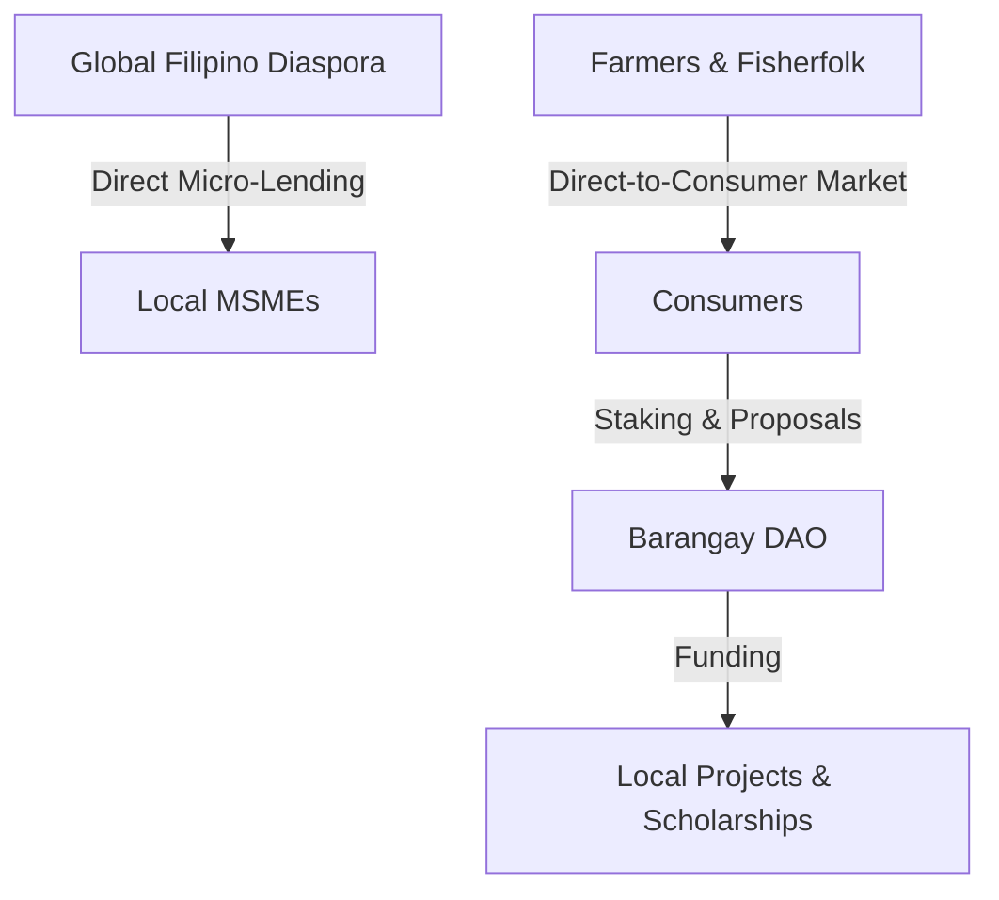

# 🇵🇭 BAYANIHAN QUANTUM COMMERCE CHAIN
## Investor Pitch Deck: Empowering the Philippine Digital Nation

---

## 🛝 Slide 1: The Cover & Vision
### **Rebuilding the Sovereign Digital Economy**
*Empowering the Philippines with a post-quantum, utility-first economic operating system that secures local commerce, credit, and community wealth.*

```
                       ┌────────────────────────────────┐
                       │   BAYANIHAN COMMERCE CHAIN     │
                       │    Post-Quantum. Compliant.    │
                       └────────────────────────────────┘
```

> **The Vision:** To transition the Philippine economy from high-friction, middleman-dominated retail transaction systems into a decentralized, high-efficiency digital nation powered by community ownership.

---

## 🛝 Slide 2: The Problem
### **Structural Friction in the Emerging Philippine Economy**

The Philippine market experiences four major structural bottlenecks that trap wealth and stifle GDP growth:

1. **The Intermediary Tax (Agriculture):** Farmers and fisherfolk lose up to **70% of crop value** to middlemen networks, creating a high-poverty trap in rural provinces.
2. **The MSME Financing Desert:** Micro, Small, and Medium Enterprises (MSMEs) generate **63% of local employment** but receive **less than 10% of banking credit** due to a complete lack of formal financial history or credit scoring.
3. **Unproductive Remittances:** Overseas Filipino Workers (OFWs) send over **$30 Billion annually**, yet these funds are primarily channeled into short-term retail consumption rather than productive local capital assets.
4. **Local Government Deficits:** Digital municipalities (Barangays) lack self-funding, transparent, and democratic infrastructure to directly finance micro-utilities, student scholarships, and mutual security nets.

---

## 🛝 Slide 3: The Solution
### **Bayanihan: An Integrated Decentralized Economic Operating System**

Bayanihan bypasses traditional financial bottlenecks by integrating local commerce, credit scoring, diaspora capital, and community safety nets into a single, automated, and low-friction ecosystem.



* **Direct Livelihoods:** Connects food producers directly to consumers, redirecting middleman margins back to local communities.
* **On-Chain Reputation:** Constructs transaction-based credit profiles to unlock funding for unbanked micro-merchants.
* **Sovereign Capital Pooling:** Channels diaspora capital directly into community-run solar grids, cooperatives, and mortgages.

---

## 🛝 Slide 4: The Product Architecture
### **15 Specialized Smart Contracts Working in Harmony**

The platform is built on a modular three-tier smart contract stack that isolates roles, audits identity, and routes token streams securely.

* **Core Infrastructure:** [`QuantumIdentity.sol`](file:///c:/Users/janla/Bayanihan/contracts/core/QuantumIdentity.sol) handles post-quantum logins; [`AIReputationOracle.sol`](file:///c:/Users/janla/Bayanihan/contracts/core/AIReputationOracle.sol) processes reputation and credit logs; and [`NationalRewardsTreasury.sol`](file:///c:/Users/janla/Bayanihan/contracts/core/NationalRewardsTreasury.sol) manages ecosystem reward caps.
* **Sectoral Livelihoods:** 
  * **Agriculture:** [`FarmerProsperity.sol`](file:///c:/Users/janla/Bayanihan/contracts/features/FarmerProsperity.sol) and [`FisherfolkRewards.sol`](file:///c:/Users/janla/Bayanihan/contracts/features/FisherfolkRewards.sol) handle DTC crop sales and weather-indexed insurance.
  * **Commerce & Education:** [`MSMEGrowth.sol`](file:///c:/Users/janla/Bayanihan/contracts/features/MSMEGrowth.sol), [`FreelancerEscrow.sol`](file:///c:/Users/janla/Bayanihan/contracts/features/FreelancerEscrow.sol), and [`EducationRewards.sol`](file:///c:/Users/janla/Bayanihan/contracts/features/EducationRewards.sol) manage merchant ratings, freelance milestone escrows, and soulbound credentials.
  * **Utilities:** [`RenewableEnergy.sol`](file:///c:/Users/janla/Bayanihan/contracts/features/RenewableEnergy.sol) records clean solar generation.
* **Community Solidarity:** [`BarangayDAO.sol`](file:///c:/Users/janla/Bayanihan/contracts/features/BarangayDAO.sol), [`HealthcareAssistance.sol`](file:///c:/Users/janla/Bayanihan/contracts/features/HealthcareAssistance.sol), [`HousingCooperative.sol`](file:///c:/Users/janla/Bayanihan/contracts/features/HousingCooperative.sol), and [`DiasporaNetwork.sol`](file:///c:/Users/janla/Bayanihan/contracts/features/DiasporaNetwork.sol) manage municipal voting, health paluwagans, mortgages, and OFW lending.
* **Legacy:** [`NationalAssetTokenization.sol`](file:///c:/Users/janla/Bayanihan/contracts/features/NationalAssetTokenization.sol) fractions community assets, and [`BayaniLegacy.sol`](file:///c:/Users/janla/Bayanihan/contracts/features/BayaniLegacy.sol) manages automated succession trust pools.

---

## 🛝 Slide 5: Market Opportunity & TAM
### **The Perfect Market for Web3 Utility Infrastructure**

The Philippines represents the highest conviction market globally for decentralized commerce and remittances:

* **#1 Globally in Web3 Adoption:** Consistently ranks at the top for crypto adoption, gaming, and digital wallet penetration (85M+ active mobile wallets).
* **Massive Livelihoods Segment:** 1.08M registered MSMEs and over 5M informal sector merchants who are entirely unbanked but rely on mobile commerce.
* **$30B+ Sovereign Flow:** Remittance infrastructure fees eat up 6-10% ($1.8B - $3B) of migrant wealth annually.
* **Addressable Market (TAM):**
  * **TAM (Total Addressable Market):** $30B annual remittance and hyper-local retail transaction volumes.
  * **SAM (Serviceable Addressable Market):** $5.4B in digital agricultural commerce, freelance payments, and MSME credit markets.
  * **SOM (Serviceable Obtainable Market):** $350M transaction volume captured across 50 partner municipal Barangays and agricultural cooperatives in 3 years.

---

## 🛝 Slide 6: Business Model & Token Dynamics
### **Value Capture via the Equation of Exchange (MV = PQ)**

Standard speculation-driven token models are volatile and face heavy regulatory scrutiny. Bayanihan uses a **Utility Lockup Model** to link token capitalization ($M$) directly to the productive GDP of the digital nation ($Q$):

$$M = \frac{P \times Q}{V}$$

```
                ┌──────────────────────────────────────────────┐
                │   TOTAL TOKEN TRANSACTION VOLUME (PQ / GDP)  │
                └──────────────────────┬───────────────────────┘
                                       │
                                       ▼
                       ┌──────────────────────────────┐
                       │  REDUCED VELOCITY (V) VIA    │
                       │     UTILITY LOCKUPS (L)      │
                       └──────────────┬───────────────┘
                                       │
                                       ▼
                ┌──────────────────────────────────────────────┐
                │  STABILIZED & GROWING MARKET VALUE OF BAYANI  │
                └──────────────────────────────────────────────┘
```

* **Velocity Control via Multi-Pool Lockups:** Tokens are locked out of circulating supply inside active escrows, Barangay DAO governance stakes, mutual healthcare reserves, and cooperative mortgage pools.
* **Mathematical Defensibility:** Locking **50% of the total supply** in active utility operations halves token velocity ($V$), doubling the required token capitalization ($M$) for any given transaction volume ($Q$).
* **Ecosystem Fee Flywheel:** A minor 0.5% transaction fee is charged on marketplaces (farmers, freelancers) and RWA registries, which is routed directly back to the National Rewards Treasury to incentivize community validator checks.

---

## 🛝 Slide 7: Technology Defensibility
### **Post-Quantum Resilience & W3C DID Credentials**

Bayanihan is architected for long-term security, implementing cryptographic features that ensure the digital nation remains uncompromisable:

1. **Post-Quantum Cryptographic Agility:** The [`QuantumIdentity.sol`](file:///c:/Users/janla/Bayanihan/contracts/core/QuantumIdentity.sol) contract decouples identities from static ECDSA private keys. By mapping dynamic slots to `PQKey` structures, the system can instantly support precompiled post-quantum signatures (Crystals-Dilithium, Falcon, SPHINCS+) without rebuilding state databases.
2. **Veramo Decentralized Identity Engine:** Off-chain, the system utilizes a custom W3C-compliant Veramo DID SDK to verify national registration numbers, biometric signatures, and role-based permissions. Once verified, this credential status is securely bridged on-chain.
3. **Multi-Guardian Social Recovery:** Eliminates seed phrase vulnerability. If a user loses access, a quorum of nominated neighbors/cooperative members executes a secure, on-chain key rotation.

---

## 🛝 Slide 8: Regulatory Moat & Compliance Architecture
### **Strict Defensibility within SEC CASP and BSP Perimeters**

We have structurally mitigated securities and money-transmission exposure through precise smart contract rules:

| Regulatory Challenge | Smart Contract Guardrails | Compliance Status |
| :--- | :--- | :--- |
| **SEC Securities Perimeter** | No passive staking yield. Returns on tokenized physical assets ([`NationalAssetTokenization.sol`](file:///c:/Users/janla/Bayanihan/contracts/features/NationalAssetTokenization.sol)) are distributed **exclusively as service discount points**, not cash dividends. This avoids the Howey Test / Investment Contract classification. | **Exempt Utility** |
| **Speculative Manipulation** | All credentials (academic degrees, merchant ratings, agricultural identities) are minted as **non-transferable Soulbound tokens** (SBTs). | **Non-Speculative** |
| **BSP Circular 1108 (VASP)** | The on-chain protocol processes only `BAYANI` utility tokens. All fiat (PHP) conversions and cash-outs are handled off-chain by licensed partner VASP portals. | **License Insulated** |

---

## 🛝 Slide 9: Go-To-Market (GTM) Strategy
### **Barangay-by-Barangay Grassroots Distribution**

Bayanihan bypasses traditional expensive B2C customer acquisition costs through a structural cooperative distribution model:

```
    Phase 1                       Phase 2                       Phase 3
 ┌───────────┐                 ┌───────────┐                 ┌───────────┐
 │ Municipal │  ━━━━━━━━━━━━>  │ Producer  │  ━━━━━━━━━━━━>  │ Consumer  │
 │ Alliances │                 │  Alliances│                 │ Engagement│
 └───────────┘                 └───────────┘                 └───────────┘
Secure partnerships with      Deploy harvest escrows to     Onboard retail buyers
Barangay captains to use      co-op federations (coconut,   by offering high-quality
DAO governance tools.         rice, tuna) for DTC logistics. produce at 20% discounts.
```

* **Local Government Partnerships:** Partner with local municipal government units (LGUs) to digitize Barangay administration, municipal voting, and scholarship distributions via [`BarangayDAO.sol`](file:///c:/Users/janla/Bayanihan/contracts/features/BarangayDAO.sol).
* **Agricultural Cooperatives:** Partner directly with local cooperative federations. By deploying harvest escrows, co-ops eliminate middlemen fees, immediately boosting farmer revenues by 30-40% while lowering retail buyer costs.
* **OFW Remittance Corridors:** Target Overseas Filipino organizations in Hong Kong, Singapore, and the Middle East, offering them direct, high-transparency micro-lending pools to support relatives without transfer fees.

---

## 🛝 Slide 10: Traction & Milestones
### **Phase 2 Development Complete & Verified**

We have transformed the initial concept into an enterprise-ready, compiled, and tested codebase:

* **15 Smart Contracts Deployed & Tested:** Complete core, feature, and mock ecosystem compiled under Solidity `0.8.20`.
* **100% Test Coverage:** Hardhat automated testing suite covers all scenarios, verifying role-based access control, escrow settlements, weather insurance payouts, reputation scoring, and social recovery features.
* **Veramo DID KYC CLI Integrated:** A fully functional command-line utility is built to issue, sign, and verify W3C credentials, bridging off-chain identity to the secure on-chain identity registry.

---

## 🛝 Slide 11: The Ask & Use of Funds
### **Seed Round: $2.5M to Scale the Digital Nation**

We are raising a $2.5M Seed Round (via SAFT with Equity Warrant structure) to fund the next 18 months of product and market growth:

```
            ┌──────────────────────────────────────────────┐
            │             USE OF SEED FUNDS                │
            └──────────────────────┬───────────────────────┘
          ┌────────────────────────┼────────────────────────┐
          ▼                        ▼                        ▼
  ┌───────────────┐        ┌───────────────┐        ┌───────────────┐
  │ Audits & Sec  │        │ LGU Pilot GTM │        │ Licensing/Ops │
  │     30%       │        │     45%       │        │     25%       │
  └───────────────┘        └───────────────┘        └───────────────┘
```

* **Audits & Security (30%):** Top-tier Smart Contract audits (OpenZeppelin, Halborn, or Trail of Bits) and continuous bug bounty pools.
* **LGU Pilot & GTM (45%):** Field onboarding agents, cooperative integrations, and local marketing support to deploy across 15 pilot municipalities in the Philippines.
* **Licensing, Partnerships, & Operations (25%):** Legal counsel for regulatory SEC/BSP compliance frameworks and technical integrations with licensed local VASP/Electronic Money Issuer (EMI) payment rails.

---

## 🛝 Slide 12: Team & Call to Action
### **Join the Sovereign Economic Movement**

We are a team of decentralized financial architects, Philippine regulatory experts, and senior full-stack developers.

* **Contact:** investment@bayanihan.network
* **Slogan:** *Communal strength. Modern tech. Sovereign future.*
* **GitHub Repository:** [Bayanihan Smart Contracts](file:///c:/Users/janla/Bayanihan/contracts/)

---
