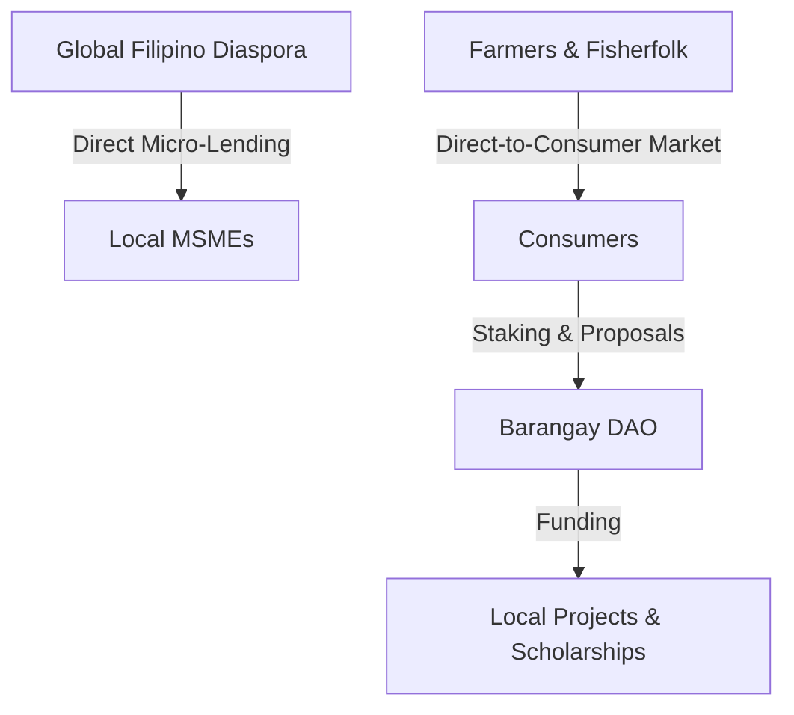

# 🇵🇭 Bayanihan Quantum Commerce Chain: Pitch & Valuation Framework

This document outlines the strategic value proposition (the Pitch), the utility-first tokenomics model, and the economic valuation framework for the **Bayanihan Quantum Commerce Chain**. It details how the platform addresses structural challenges in the Philippine economy while mitigating regulatory risks.

---

## 📢 1. The Pitch: A Decentralized Economic Operating System

### The Problem
The Philippine economic landscape is restricted by structural inefficiencies:
1. **Middleman Exploitation:** Farmers and fisherfolk lose up to 70% of crop value to intermediary logistical networks.
2. **MSME Financing Gap:** Small businesses contribute 63% of employment but receive less than 10% of banking credit due to a lack of formal credit scoring.
3. **Friction in Remittances:** OFWs send over $30B annually, but funds are consumed by retail consumption rather than local capital formation.
4. **Hyper-local Infrastructure Deficits:** Barangays lack democratic, self-funded tools to execute local infrastructure projects.

### The Solution
The **Bayanihan Quantum Commerce Chain (Phase 2)** is a decentralized, post-quantum resilient economic operating system. It bypasses middlemen, constructs organic reputation scores, connects OFW capital directly with local business collateral, and establishes self-funding democratic micro-economies.

### Core Value Drivers
* **Direct-to-Consumer (DTC) Settlement:** Forward-sale escrows allow direct retail buyer matching, triggering a **3x reward multiplier** from the Treasury.
* **On-Chain Credit Scoring:** AI reputation oracles synthesize transaction volumes, longevity, and reviews to output credit ratings, facilitating immediate financing access.
* **Frictionless OFW Capital Routing:** Allows OFWs to participate in local asset tokenization (dry warehouses, solar grids) and micro-lending directly.

---

## 🪙 2. Utility-First Tokenomics: Non-Security Alignment

To prevent classification as an unregistered security under the **Philippine SEC CASP perimeter** and the US Howey Test, the `BAYANI` token is designed strictly with functional utility:

| Utility Vector | Mechanism | Regulatory Protection |
| :--- | :--- | :--- |
| **Escrow Collateral** | Locked in Freelancer and Harvest marketplaces to guarantee delivery. | Transaction execution, not investment. |
| **Cooperative Governance** | Staked in Barangay DAO to boost voting weight. Staking weight is capped. | Prevents plutocratic capture and passive yield claims. |
| **Services Payment** | Burned or paid for medical coverage pools, solar energy, and cooperative mortgages. | Traditional payment utility. |
| **RWA Access Registry** | Requires `QuantumIdentity` check to purchase fractional asset shares. | KYC/AML check. Yield is structured as service discounts. |

> [!IMPORTANT]
> **No Passive Yield:** Staking does not return passive token emissions or interest. All treasury distributions are performance-based (active crop registry, clean energy generation, proposal auditing).

---

## 📊 3. Economic Valuation Framework

Standard Discounted Cash Flow (DCF) models assume equity-like cash distributions, which would classify `BAYANI` as a security. Instead, we value the ecosystem using the **Equation of Exchange (MV = PQ)** and **Utility Lockup Dynamics**.

### A. The Equation of Exchange (MV = PQ)
We define:
* **$M$** = Total required market capitalization of `BAYANI` tokens in circulation.
* **$V$** = Velocity of the token (the number of times a token changes hands per year).
* **$P$** = Average price of digital services/goods in the ecosystem.
* **$Q$** = Total quantity of economic utility transactions executed (Philippine digital nation GDP).

$$M = \frac{P \times Q}{V}$$

As the transaction volume ($P \times Q$) grows (more crops sold, more solar kWh tracked, more freelance projects executed), the required token capitalization ($M$) increases, driving token value through **economic utility rather than speculation**.

### B. The Utility Lockup Velocity Model
Token velocity ($V$) is key. If velocity is high, a small token supply can support a large transaction volume, keeping token value low. Bayanihan reduces $V$ by design through **Utility Lockups**:

$$V = \frac{\text{Circulating Supply}}{\text{Total Supply} - \text{Locked Supply}} \times V_{\text{circ}}$$

Where tokens are locked in:
1. **Milestone Escrows:** (Freelancers and Farmers) Tokens are locked for 30–180 days.
2. **Cooperative Mortgages:** Locked in shared-equity pools.
3. **Barangay Staking Pools:** Staked to maintain governance weight.
4. **Mutual Health Pools:** Committed to co-insure emergency health needs.

By locking **45–60% of the total supply** in active economic operations, the circulating velocity ($V$) is minimized, mathematically driving $M$ up as utility transaction volume ($Q$) expands.

---

## ⚠️ 4. Risk Analysis & Mitigation

### A. Technical Risks & Vulnerabilities
* **Oracle Manipulation:** Weather oracles (crop insurance) and smart meters (solar tracking) can be spoofed or front-run.
  * *Mitigation:* Multi-oracle consensus frameworks and ECDSA cryptographic signatures verified on-chain.
* **Smart Contract Reentrancy:** Large capital is held in the Freelancer Escrow, Barangay DAO, and Healthcare Assistance pools.
  * *Mitigation:* Inheriting OpenZeppelin's `ReentrancyGuard`, following the Checks-Effects-Interactions pattern, and implementing `Pausable` mechanisms.

### B. Regulatory Exposure & Mitigation
* **SEC Security Classification Risk:** RWA tokenization (warehouses, dryers) resembles fractional real estate investments.
  * *Mitigation:* The [`NationalAssetTokenization.sol`](file:///c:/Users/janla/Bayanihan/contracts/features/NationalAssetTokenization.sol) contract distributes returns only as service discounts (e.g., free warehouse storage credits), not cash dividends. This avoids classification as a security.
* **BSP Circular 1108 (VASP Licensing):** Conversion of fiat (PHP) to `BAYANI` triggers VASP perimeter licensing.
  * *Mitigation:* Separation of layers. Smart contracts handle only utility tokens. All fiat conversion is routed off-chain to licensed, BSP-approved VASP partners.
* **Identity and AML Compliance:**
  * *Mitigation:* The [`QuantumIdentity.sol`](file:///c:/Users/janla/Bayanihan/contracts/core/QuantumIdentity.sol) contract utilizes soulbound tokens (non-transferable ERC-721 profiles) mapping addresses to biometric and national registry hashes, ensuring KYC/AML compliance.
