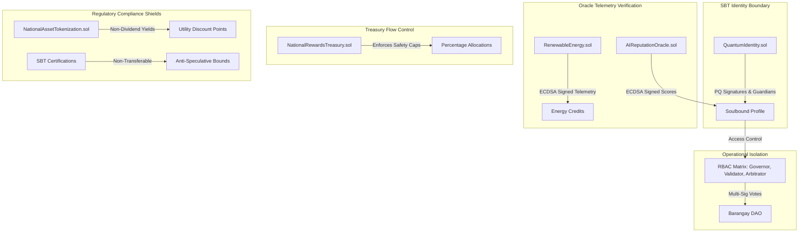
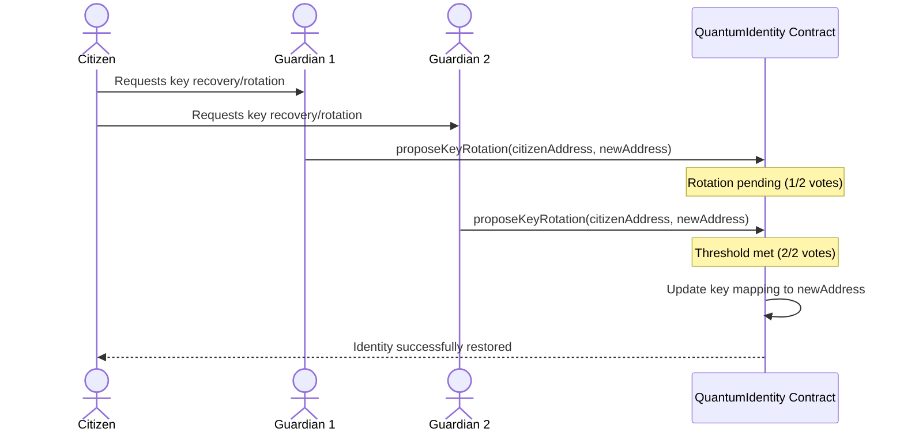

# 🛡️ BAYANIHAN QUANTUM COMMERCE CHAIN: SECURITY BLUEPRINT
## Comprehensive Security Architecture & Risk Mitigation Blueprint

This document details the multi-layered security architecture of the **Bayanihan Quantum Commerce Chain (Phase 2)**. It defines the cryptographic controls, smart contract execution parameters, oracle integrations, operational roles, and regulatory perimeter isolation designs that protect the decentralized digital nation.

---

## 1. Security Architecture Overview

The Bayanihan security posture is organized into five defense-in-depth layers. Rather than relying on a single security perimeter, each module isolates execution states, limits operational limits, and enforces verified identities before tokens or data stream through the system.



---

## 2. Pillar 1: Cryptographic Agility & Post-Quantum Identity

Traditional blockchain accounts bind ownership to static ECDSA private keys (`secp256k1`). In a post-quantum computing era, ECDSA is vulnerable to mathematical derivation. To mitigate this threat, the [`QuantumIdentity.sol`](file:///c:/Users/janla/Bayanihan/contracts/core/QuantumIdentity.sol) contract decouples user identity profiles from specific signing keys.

### A. Key-Agile Data Architecture
Instead of storing public key addresses directly, citizen profiles store arrays of cryptographic slots representing post-quantum public keys (`PQKey`):

```solidity
struct PQKey {
    string algorithm; // e.g. "CRYSTALS-Dilithium", "Falcon", "SPHINCS+"
    bytes publicKey;
    uint256 updatedTime;
}
```

* **Algorithm Plug-ins:** The system supports dynamic updates to post-quantum signatures without changing the citizen's on-chain identifier.
* **Metadata Privacy:** No personal identifiable information (PII) is stored on-chain. Citizens map to identity records via SHA-256 biometric and national registry hashes validated off-chain.

### B. Social Recovery and Guardian Voting
In case of signing key loss or compromise, citizens utilize a trust-minimized social recovery mechanism:



1. **Nomination:** During registration, citizens nominate two or more independent `Recovery Guardians` (such as local cooperative officers or trusted relatives).
2. **Proposal:** A recovery proposal is initiated on-chain by one guardian, specifying the citizen's profile and the proposed new address.
3. **Execution:** Once a threshold of guardians (e.g. 2-of-2) approves the proposal, the mapping resets to the new address.

---

## 3. Pillar 2: Contract Execution & Reentrancy Guards

In decentralized finance, contract-to-contract reentrancy represents a primary vector for cash depletion. Bayanihan applies strict code engineering guidelines to secure token stores inside the [FreelancerEscrow.sol](file:///c:/Users/janla/Bayanihan/contracts/features/FreelancerEscrow.sol), [HealthcareAssistance.sol](file:///c:/Users/janla/Bayanihan/contracts/features/HealthcareAssistance.sol), and [FarmerProsperity.sol](file:///c:/Users/janla/Bayanihan/contracts/features/FarmerProsperity.sol) contracts.

### A. Checks-Effects-Interactions Pattern
All state mutations are written to execute strictly in order:
1. **Checks:** Validate call permissions, balances, timestamps, and parameters (e.g., `require` statements).
2. **Effects:** Mutate local contract storage variables (e.g., updating user balance mappings or marking escrow milestones as paid).
3. **Interactions:** Perform external calls or token transfers (e.g., calling `transfer` on the ERC-20 token).

This prevents attackers from intercepting contract control mid-transaction to perform loops.

### B. Defensive Control Modifiers
* **ReentrancyGuard:** All transfer-capable functions are wrapped with OpenZeppelin's `nonReentrant` modifier, enforcing gas-locked execution mutexes.
* **Pausable Circuit Breakers:** Critical user-facing actions inherit OpenZeppelin's `Pausable` contract. In the event of an anomaly, governors can instantly halt operations (such as escrow creations or RWA purchases) while maintaining query availability.

---

## 4. Pillar 3: Oracle Telemetry & Signed Message Verification

To bridge physical reality (crop records, weather indexes, smart meter readings, AI credit ratings) with the blockchain, Bayanihan implements strict cryptographic message verification for oracles rather than relying on trust.

### A. Telemetry Signature Recovery
In the [`RenewableEnergy.sol`](file:///c:/Users/janla/Bayanihan/contracts/features/RenewableEnergy.sol) contract, smart meter telemetry data is signed by an authorized telemetry hardware node off-chain and verified on-chain:

```solidity
bytes32 messageHash = keccak256(abi.encodePacked(producer, deviceId, kwhGenerated, timestamp));
bytes32 ethSignedMessageHash = keccak256(abi.encodePacked("\x19Ethereum Signed Message:\n32", messageHash));
address signer = ECDSA.recover(ethSignedMessageHash, signature);
require(hasRole(METER_ORACLE_ROLE, signer), "Invalid signature: Not signed by authorized meter oracle");
```

This ensures:
* **Anti-Spoofing:** Users cannot mock generation metrics to claim false incentives.
* **Telemetry Longevity:** Timestamp parameters prevent replay attacks where old signatures are submitted multiple times.

### B. AI Credit Score Authenticity
Similarly, the [`AIReputationOracle.sol`](file:///c:/Users/janla/Bayanihan/contracts/core/AIReputationOracle.sol) validates credit and reputation updates from off-chain analysis nodes by validating the signature of an authorized public key (`REPUTATION_ORACLE_ROLE`) on-chain.

### C. Off-Chain Private Key Protection (OpenBao Secrets Manager)
To prevent plain-text exposure of private keys for the validator nodes and oracle authorities, the KYC bridging server retrieves signing credentials dynamically at runtime from an **OpenBao Secrets Manager** KV engine (via standard REST APIs protected by client token headers). This eliminates hardcoded credentials in files and isolates cryptographic material.

---

## 5. Pillar 4: Economic Controls & Budget Rate-Limiting

The [`NationalRewardsTreasury.sol`](file:///c:/Users/janla/Bayanihan/contracts/core/NationalRewardsTreasury.sol) contract functions as the central vault for ecosystem emissions. To prevent one sector or exploit from draining the pool, the treasury implements a hardcoded rate-limiting system.

### A. Safety-Capped Allocations
The treasury maps allocations to strict categories which are checked dynamically:

| Allocation Category | Percentage Cap | Target Subsystems |
| :--- | :---: | :--- |
| `CommunityTreasury` | **35%** | Cooperative Mortgages, Healthcare Pool assistance |
| `EcosystemRewards` | **25%** | Active farmers, fishers, MSMEs, and freelancers |
| `CoreTeam` | **10%** | Development and operations |
| `Founder` | **5%** | Founders allocations |
| `Validators` | **10%** | Barangay DAO proposals, audit tasks |
| `Liquidity` | **5%** | Market making, price stability |
| `Marketing` | **5%** | Community expansion, onboarding campaigns |
| `Reserve` | **3%** | Emergency reserves |
| `Advisors` | **2%** | Strategic consultants |

### B. Dynamic Budget Calculations
Every reward request executes a check against historical allocations and deposits:

$$\text{Max Allowed Category Payout} = \frac{\text{Total Historical Pool Deposits} \times \text{Category Percentage}}{100}$$

If a claim exceeds this maximum allowed threshold, the transaction reverts with `"Exceeds category budget allocation"`. This ensures that even in the case of a feature contract exploit, the maximum financial exposure is strictly bounded to that category's cap.

### C. Treasury-Routed Crop Insurance Solvency
To protect agricultural participants from contract-level liquidity defaults, [`FarmerProsperity.sol`](file:///c:/Users/janla/Bayanihan/contracts/features/FarmerProsperity.sol) routes premiums and claims through the main `NationalRewardsTreasury`. Paid premiums are automatically forwarded to the global pool via `depositFunds()`, and weather claim payouts are drawn from the treasury's `Reserve` category cap. This routes parametric insurance risk into the broader, solvent treasury structure.

---

## 6. Pillar 5: Regulatory Compliance Perimeters

Bayanihan is engineered to comply with the perimeters of the **Philippine SEC** (Howey Test / CASP guidelines) and the **Bangko Sentral ng Pilipinas (BSP)** (Virtual Asset Service Provider regulations).

### A. Securities Classification Prevention
* **Utility-Discount RWAs:** Under the SEC CASP guidelines, tokens offering passive yields or dividend returns are treated as investment contracts. In [`NationalAssetTokenization.sol`](file:///c:/Users/janla/Bayanihan/contracts/features/NationalAssetTokenization.sol), shareholdings in tokenized assets (e.g. drying yards or warehouses) generate **non-dividend service utility points**. These points cannot be traded on secondary markets and are burned solely to claim service discounts, bypassing securities classification.
* **Soulbound Tokens (SBTs):** Skill certificates, merchant levels, and citizen credentials inherit non-transferable overrides to block speculative secondary markets.

### B. BSP VASP Isolation
* **Separation of Layers:** No smart contracts process fiat currency (Philippine Pesos). The chain operates exclusively using the `BAYANI` utility token.
* **VASP Gateway Boundary:** All conversions between fiat and crypto are routed to external, licensed VASP operators off-chain, protecting the core smart contracts from unlicensed money transmitter categorization.

---

## 7. Operational Roles & Access Matrix (RBAC)

Bayanihan enforces separation of duties via an access control matrix. No single administrator has global access to all contracts.

| Role | Access Scope | Target Contracts |
| :--- | :--- | :--- |
| `GOVERNOR_ROLE` | Sets global configurations, updates oracle keys, calls `pause()`. | All Core & Feature Contracts |
| `VALIDATOR_ROLE` | Verifies new citizens, updates key rotations. | `QuantumIdentity.sol` |
| `REPUTATION_ORACLE_ROLE` | Submits audited reputation scores. | `AIReputationOracle.sol` |
| `METER_ORACLE_ROLE` | Signs telemetry generation logs. | `RenewableEnergy.sol` |
| `ARBITRATOR_ROLE` | Settles disputes, releases/refunds escrow milestones. | `FreelancerEscrow.sol` |
| `MEDICAL_REVIEWER_ROLE` | Approves health insurance emergency payouts. | `HealthcareAssistance.sol` |
| `DISTRIBUTOR_ROLE` | Authorized contracts allowed to request reward claims. | `NationalRewardsTreasury.sol` |

* **Gnosis Safe Multi-Sig Admin Handoff:** In production Mainnet deployments, the `GOVERNOR_ROLE` and `DEFAULT_ADMIN_ROLE` privileges are transferred dynamically during setup via the automated `scripts/deploy.js` script to a Gnosis Safe Multi-Sig address, removing single-key control points of failure.

---

## 8. Incident Response & Disaster Recovery (DR)

### A. Circuit Breakers (Pausability)
In the event of an active contract exploit or extreme market volatility, any account possessing the `GOVERNOR_ROLE` can invoke the `pause()` method on critical contracts. This immediately stops state-changing transactions while preserving read access for audit analysis.

### B. Emergency Token Salvage
If tokens are mistakenly sent directly to the core infrastructure contracts (or if contracts need to be decommissioned), governors can execute `emergencyWithdraw(address token, uint256 amount)` to safely salvage the tokens and redirect them to a cold multisig wallet.

### C. Automated Vulnerability Scanning (Slither)
Smart contracts are subjected to automated static security checks via the **Slither** framework (by Trail of Bits) to audit access control matrices, detect reentrancy conditions, and check mathematical perimeters. Settings are defined in `slither.config.json` and executed via the run scripts (`run-slither.bat` / `run-slither.sh`).
