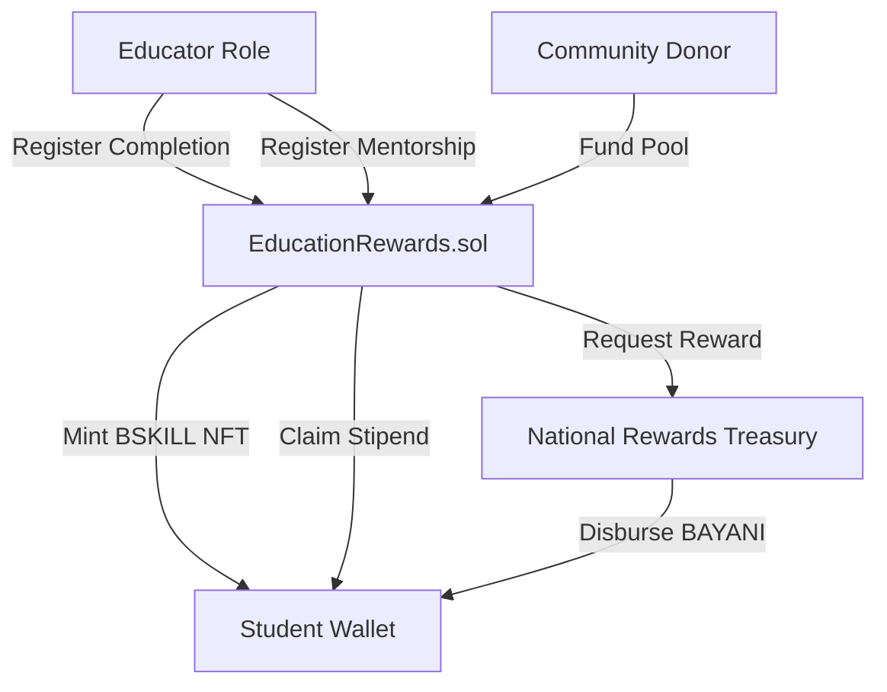

# 🇵🇭 Bayanihan Education & Skill NFT (BSKILL) Framework

The [`EducationRewards`](file:///c:/Users/janla/Bayanihan/contracts/features/EducationRewards.sol) contract defines the educational and skill certification economy of the Bayanihan digital nation. It utilizes non-transferable (soulbound) NFTs to reward active learning, teaching, and mentorship.

---

## 🏛️ Architecture Overview

The system binds verified educational outcomes to treasury rewards and scholarship endowments.

### Key Parameters
* **Token Standard**: ERC-721 (Non-Transferable / Soulbound)
* **Token Name**: `Bayani Skill NFT`
* **Token Symbol**: `BSKILL`
* **Ecosystem Treasury Category**: `Education`

---

## 🎓 Reward Allocations

To incentivize human capital development without creating speculative token pools, educational rewards are disbursed directly to active participants:

| Action Trigger | Reward Amount | Recipient | Description |
| :--- | :--- | :--- | :--- |
| **Course Completion** | `2 BAYANI` | Student | Triggered upon completing a vocational, agricultural, or digital course. |
| **Assessment Pass** | `3 BAYANI` | Student | Earned upon passing a verified, hands-on skill assessment. |
| **Class Taught** | `10 BAYANI` | Teacher / Educator | Paid to verified instructors leading community classes. |
| **Mentorship Logged** | `5 BAYANI` | Mentor | Rewarded to experienced citizens tutoring/mentoring newer members. |

---

## 📈 Scholar Level Progressions

Completed courses are logged on-chain. As students hit specific thresholds, their profile levels up, unlocking higher scholarship priority and reputation weightings:

* **Level 0: None**
  * Baseline student profile.
* **Level 1: Bronze Scholar**
  * *Requirement*: Completed **10 courses**.
  * *Perk*: Priority listing for basic vocational internship assignments.
* **Level 2: Silver Scholar**
  * *Requirement*: Completed **50 courses**.
  * *Perk*: Eligible for partial cooperative student stipends.
* **Level 3: Gold Scholar**
  * *Requirement*: Completed **100 courses**.
  * *Perk*: eligible for full scholarship stipends + community mentoring roles.
* **Level 4: National Scholar**
  * *Requirement*: Completed **500 courses**.
  * *Perk*: Lifetime validator candidacy + highest priority research grants.

---

## 💰 Donor-Funded Scholarship Pool

In addition to state-funded learning rewards, local cooperatives and foreign donors can establish targeted scholarship funds:

1. **Funding the Pool (`fundScholarship`)**:
   * Anyone can deposit BAYANI tokens into the contract using `fundScholarship(amount)`.
   * These funds are locked exclusively for educational allocations.
2. **Allocating Stipends (`allocateScholarship`)**:
   * Barangay DAO Governors (`GOVERNOR_ROLE`) review student applications and allocate BAYANI amounts from the pool to specific student addresses.
3. **Claiming Stipends (`claimScholarshipStipend`)**:
   * Verified student scholars submit claims to withdraw their allocated stipends directly to their wallets.

---

## 🔒 Soulbound Security (Non-Transferability)

To maintain credential integrity and prevent commercialization:
* All `transferFrom` and `safeTransferFrom` functions are explicitly overridden to revert with `Soulbound: Transfers not allowed`.
* BSKILL certificates cannot be traded, sold, or used as collateral on secondary markets, serving purely as verifiable, zero-knowledge on-chain reputation components.
